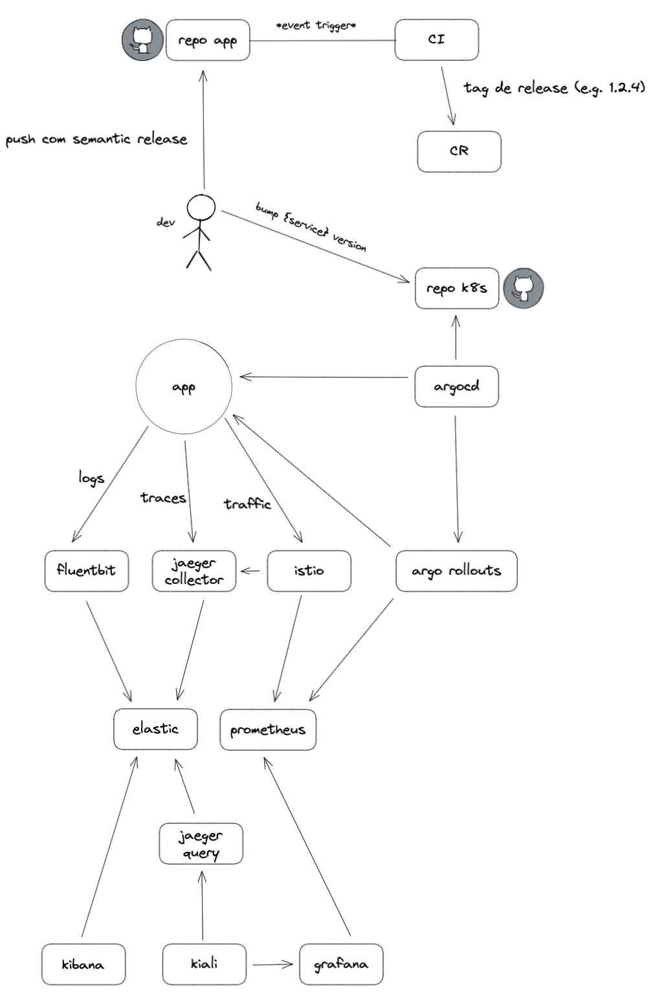

# Boostrap

1.  Setup a Kubernetes cluster
I highly recommend [K3D](https://k3d.io/)

2.  Run each line of [setup.sh](setup/setup.sh)
Try to understand each command and the files they reference

# Tools

-   [Kubernetes](https://kubernetes.io/)
-   [Git](https://git-scm.com/)
-   [GitHub](https://github.com/)
-   [GitHub Actions](https://github.com/features/actions)
-   [Argo CD](https://argoproj.github.io/cd/)
-   [Argo Rollouts](https://argoproj.github.io/rollouts/)
-   [Prometheus](https://prometheus.io/)
-   [Elasticsearch](https://www.elastic.co/elasticsearch/)
-   [Kibana](https://www.elastic.co/kibana/)
-   [Fluent Bit](https://fluentbit.io/)
-   [Istio](https://istio.io/)
-   [Kiali](https://kiali.io/)
-   [Grafana](https://grafana.com/)
-   [semantic-release](https://github.com/semantic-release/semantic-release)

# Techniques

-   [Continuous Delivery](https://continuousdelivery.com/)
-   [GitOps](https://www.weave.works/technologies/gitops/)
